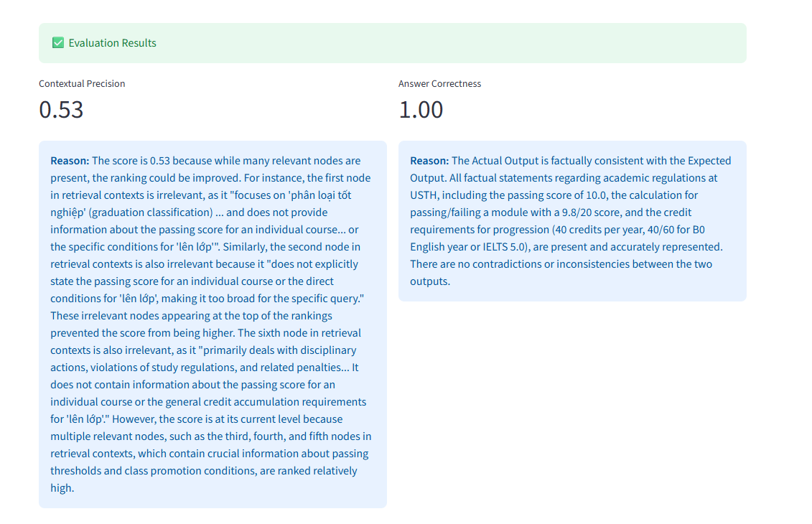

<div align="center">
    <h1>RAG Team Intro AI – Local RAG USTH Chatbot</h1>
<hr/>
</div>

###  1. Introduction

USTH Chatbot is an AI-powered question-answering system designed for students at the University of Science and Technology of Hanoi (USTH).

The chatbot allows users to ask questions based on USTH-related documents (PDFs) such as:
 - Lecture slides
 - Course materials
 - Regulations
 - Internal documents

Key features:
 - PDF ingestion with OCR support (for scanned documents)
 - Retrieval-Augmented Generation (RAG)
 - Semantic search using vector embeddings
 - Natural language answers powered by LLMs

The system focuses on accuracy, transparency, and avoiding hallucinations by strictly grounding answers in provided documents.

### 2. Team
<table>
  <thead>
    <tr>
        <th></th>
        <th>Name</th>
        <th>Student id</th>
        <th>Role</th>
    </tr>
  </thead>
  <tbody>
    <tr>
        <td>1</td>
        <td>Đào Chí Trung</td>
        <td>23BA14295</td>
        <td>Project Lead & Backend Engineer</td>
    </tr>
    <tr>
        <th>2</th>
         <td>Nguyễn Khải Minh</td>
        <td>2410607</td>
        <td>RAG Pipeline Engineer & Prompt & Evaluation</td>
    </tr>
    <tr>
        <th>3</th>
         <td>Nguyễn Ngọc Hiếu</td>
        <td>23BA14109</td>
        <td>Data Processing & OCR Engineer</td>
    </tr>
    <tr>
        <th>4</th>
        <td>Vũ Thị Kim Oanh</td>
        <td>23BA14225</td>
        <td>Research Lead & Problem Formulation</td>
    </tr>
    <tr>
        <th>5</th>
        <td>Phạm Gia Anh</td>
        <td>2410084</td>
        <td>Embedding & Vector Database Researcher</td>
    </tr>
    <tr>
        <th>6</th>
        <td>Nguyễn Thị Ngọc Ánh</td>
        <td>2411095</td>
        <td>OCR Researcher & Data Chunking</td>
    </tr>
    <tr>
        <th>7</th>
        <td>Nguyễn Xuân Chuyên</td>
        <td>2410181</td>
        <td>RAG Core Engineer & Evaluation</td>
    </tr>

  </tbody>
</table>

### 3. Installation
3.1 Requirements
 - Python ≤ 3.11 ( Python 3.12 is not supported)
 - Git
 - (Optional) NVIDIA GPU for faster embedding

3.2 Clone the repository
```bash
git clone https://github.com/your-username/usth-chatbot.git
cd usth-chatbot
```

3.3 Create virtual environment
```bash
python -m venv venv
source venv/bin/activate        # Linux / macOS
venv\Scripts\activate           # Windows
```

3.4 Install dependencies
```bash
pip install -r requirements.txt
```
3.5 Environment variables

Create a `.env` file:
```bash 
GOOGLE_API_KEY = "Your_API_key"
```

### 4. Local Usage Example
4.1 Ingest PDF documents
Place your PDFs in the data/pdfs/ folder, then run:
```bash 
python ingestion.py
```
What happens:
 1. Load PDF files
 2. Apply OCR if needed
 3. Chunk extracted text
 4. Generate embeddings
 5. Store vectors in ChromaDB

4.2 Run the chatbot locally
```bash 
streamlit run app.py           # http://localhost:8501
```
4.3 Quick for demo testing
<div align = "center">
<p><a href="https://usthchatbotrag.streamlit.app/">USTH-Chatbot</a><p>
<p><a href="https://docs.google.com/document/d/133bbOP1RWnCEvOU-F5CXRcbHvfVtXhdFI_-Xh43vGl8/edit?tab=t.0#heading=h.wdh4lfq93xql">Team document</a><p>
</div>

### 5. Architecture Diagram
<p align="center">
  
</p>

### 6. Evaluation Strategy
This project includes an **automatic evaluation pipeline** to assess the quality of the Agentic RAG system, focusing on both **retrieval quality** and **answer correctness**.
The evaluation is built on top of **DeepEval** and uses **Gemini (Google Generative AI)** as an LLM-based judge.

6.1 Evaluation Metrics

1️⃣ Contextual Precision
We use `ContextualPrecisionMetric` to measure how relevant the retrieved chunks are with respect to the query.

 - Threshold: `0.5`
 - Judge model: `Gemini 2.5 Flash`
 - Includes an LLM-generated explanation (`reason`) for transparency

This metric answers the question:
<div align="center">
    “Did the retriever fetch the right information?”
<hr/>
</div>

2️⃣ Answer Correctness (LLM-as-a-Judge)

We use `GEval` to evaluate factual consistency between:

 - `actual_output`
 - `expected_output`

Evaluation criteria:

<div align="center">
    Is the actual output factually consistent with the expected output?
<hr/>
</div>

This allows flexible, semantic comparison instead of strict string matching.


6.2 🤖 LLM Judge Configuration

The evaluation uses a custom DeepEval-compatible judge:

 - Model: **gemini-2.5-flash**
 - Temperature: 0 (deterministic evaluation)
 - Role: Acts as an impartial evaluator for both retrieval and answer quality


6.3 Evaluation Output

The evaluation pipeline returns structured scores:

 - Contextual Precision score + explanation
 - Answer Correctness score + explanation

These metrics can be:
- Printed to console for debugging
- Logged for experiments
 - Integrated into a Streamlit or CI evaluation workflow

Demo:
<p>
  
</p>
