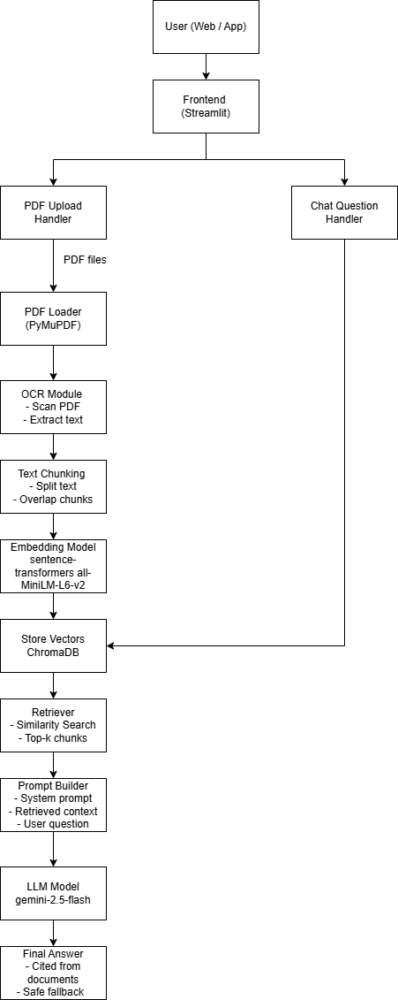

<h1>📚 RAG Team Intro AI – Local PDF RAG Chatbot</h1>

<strong>RAG Team Intro AI</strong> is a fully local
<strong>Retrieval-Augmented Generation (RAG) chatbot</strong> designed to answer
questions directly from your own <strong>PDF documents</strong>.

The system processes documents end-to-end — from loading PDFs to delivering
accurate, context-aware responses through an interactive chatbot interface.

<h2>🚀 How It Works</h2>
<ul>
  <li>📂 Automatically loads PDF files from the <code>data/</code> directory</li>
  <li>✂️ Splits documents into optimized text chunks</li>
  <li>🧠 Generates semantic embeddings using <strong>HuggingFace models</strong></li>
  <li>🗄️ Stores embeddings in <strong>ChromaDB</strong> with persistent tenant & database support</li>
  <li>💬 Provides a clean and intuitive <strong>Streamlit chatbot UI</strong></li>
</ul>

<h2>⚙️ Technologies Used</h2>
<ul>
  <li><strong>Python</strong></li>
  <li><strong>LangChain</strong></li>
  <li><strong>ChromaDB</strong> (version &ge; 1.3.x)</li>
  <li><strong>HuggingFace Embeddings</strong></li>
  <li><strong>Streamlit</strong></li>
  <li><strong>PDF Loader</strong></li>
</ul>

<strong>architecture diagram</strong>

  

